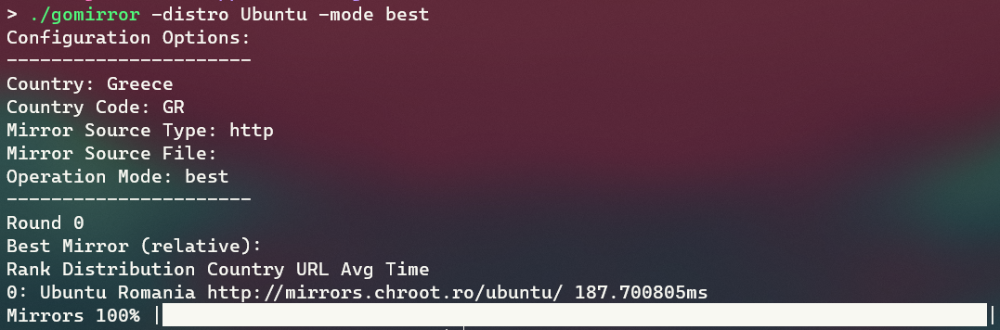

# gomirror

## About

`gomirror` is a CLI mirror ranker that its main goal is to rank or find the best mirror for a Linux distribution. Although it can be extended to be used as a more general ranker for mirrors/servers.

It is build with usability, extensibility, and performance in mind. It can quickly make thousands of requests with the power of Goroutines, to all servers in parallel. Its inputs and outputs are JSON-modeled, to allow for defined but extensible input data and results. As a CLI tool it will display any results in the standard output by default, but with the correct flag it can also output them in various formats. You can find the expected inputs/outputs for the various supported formats in the `inputs/in.template.*` and `outputs/out.template.*` directories respectively.

Its main usage is to get the available mirrors for the desired distribution (either through official website or from user input) and output the mirrors ranked or the best mirror based on the server HTTP responses.



> Note: This is a hobby project under development. Do not expect any stable functionalities until it has some features implement and some major coding redesigns. There are still a lot of features missing that will make this tool a robust tool that can be used for mirror ranking, under real circumstances.

## Supported Distributions

The supported distributions for now are:

- Arch ([1](https://archlinux.org/mirrors/status/), [2](https://archlinux.org/mirrors/status/json/))
- Debian ([1](https://www.debian.org/mirror/list), [2](https://www.debian.org/mirror/list-full))
- Ubuntu ([1](https://launchpad.net/ubuntu/+archivemirrors), [2](http://mirrors.ubuntu.com/))

## Supported Inputs and Outputs

The supported inputs for the mirrors are:

- `http` (web page with mirrors: will be either HTML parsed or JSON parsed)
- `txt` (a plain text files which has a mirror URL in every line)
- `json` (a JSON file in the expected format - with the mirror URLs and other relevant info)

The supported outputs for the mirrors are:

- `stdout` (print results in the terminal - default mode)
- `json` (print results in the expected JSON format - just like the input JSON but with the `statistics` field)
- `csv` (same as JSON but in CSV format)
- `txt` (print results in the expected mirror format for each distribution - not currently implemented)

# Program Internals

This is a brief description of the actions made during the program's execution:

- Get mirrors list:
  - If, explicit file input, read from file (TXT, JSON)
  - Else, read mirrors online (parse HTML or JSON page)
    - If, error reading (mirror site, or individual links) fallback to ready-made mirrors lists in source-code (Go maps) - not implemented.
- Create requests:
  - If country not supplied, find country automatically
  - Find round of requests (currently only 1)
  - Make 1 request per host (filter by host)
  - Generate requests statistics (HTTP response time)
- Find best distribution mirror server:
  - Based on:
    - http (time)
    - ping (time) - not implemented
    - traceroute (hops) - not implemented
    - location (country) - not implemented
- Rank distribution mirror servers:
  - Sort them
  - Show Statistics:
    - http (time)
    - ping (time) - not implemented
    - traceroute (hops) - not implemented
- Produce output:
  - Export in multiple formats: `stdout`, `json`, `csv`, `txt`

# Installation

To run the tool, first we need to clone the repository and build it:

```bash
$ git clone https://github.com/thanoskoutr/gomirror.git
$ cd gomirror
$ make
```

To have the executable available everywhere in the system we can copy it to a location that is available under the `$PATH` environmental variable (e.g. `/usr/local/bin`):

```bash
$ sudo cp ./gomirror /usr/local/bin
```

# Usage

We can run the tool with the help flag (`-h`) to view all available options:

```bash
$ ./gomirror -h
```

# Testing

To run the tests for all sub-packages (recursively):

```bash
$ go test -v ./...
```

# Other similar Tools

Of-course the inspiration for this project was the existence of other similar tools. The motive for this project was that most of the available tools are working for one distribution only, and none of them was written in Go :).

These are the available tool that I want to research further for their functionalities, inputs/flags, outputs results, etc:

- Debian: [`netselect-apt`](https://manpages.debian.org/stretch/netselect-apt/netselect-apt.1.en.html)
- Debian:[`apt-spy`](https://manpages.debian.org/testing/apt-spy/apt-spy.8.en.html)
- Arch: [`pacman-contrib/rankmirrors`](https://gitlab.archlinux.org/pacman/pacman-contrib)
- Arch: [`Reflector`](https://wiki.archlinux.org/title/Reflector)
- Arch: [`westandskif/rate-mirrors`](https://github.com/westandskif/rate-mirrors)
- General: [`marguerite/rankmirror`](https://github.com/marguerite/rankmirror)

# To Do

Because this is a unfinished project there are a LOT of things that I want to add/change. Here are some of them categorized.

## To Do - Code

Logs:

- Add dedicated logger (e.g. `zap`, `logrus`)
- Add debug logs/Convert commented prints to debug logs
- Add verbose/log option (make it a flag)
- Append error logs to separate log file (to avoid convoluting terminal output)

Progress Bar:

- Configure progress bar (colors, format, text, info)

Flags/CLI:

- Support configuration files (TOML) alongside with flags
- Add `cobra` for more configurable CLI

Docs:

- Add documentation in functions and structs (godoc)

## To Do - Requests

- Configurable timeout (make it a flag)
- For Average statistics: Make multiple (rounds of) requests per mirror
- Configurable rounds of requests (make it a flag)
- Use hops/ping/traceroute information (in addition to HTTP)
-
- Use the available internal HTTP request information, provided by `httpstats`
- Use 90th percentile stats, along with Average stats
- Add Heuristics for best mirror decision:
  - 1 request per host (filter by host, and try http only, same host can use different protocols)
  - Find locals based on country or region (make it a flag)
  - Find only those with good stats (if stats are available, e.g. in Arch mirrors)
- Support other mirror protocols:
  - Supported: `http`, `https`
  - Unsupported: `ftp`, `rsync`

## To Do - Mirrors Input

- Create backup mirrors in Go code, in case of error when parsing mirrors:
  - Convert JSON mirrors to Go maps
  - This way we only need one final binary, no dependencies
- Validate input format first (JSON, TXT) -> No need for sourceType flag

## To Do - Mirrors Output

Report options:

- Best mirror (based on heuristics, do not have to test all)
- Report for all mirrors:
  - HTTP Mirror Response Time (total time, every component time)
  - PING Mirror Response Time (total time)
  - TRACEROUTE Mirror info (Hops, every component time)
  - Country / Region info
  - Mirror Speed (MB/s)

Output format:

- Stdout output (with progress, colors, terminal format)
- Add more mirror attributes to machine format output (JSON, CSV)
- Configure mirror expected format (based on distribution/package manager)
- Update mirror on the fly (depending distro)
  - Find formats for all supported distros
  - Directly edit mirror file (e.g `/etc/apt/sources.list`)

## To Do - Distributions

- Create General Distro structure:
  - User defines JSON/TXT mirrors
  - Produces general output (not any distro specific operation)
- Plugin/Templating system for custom distros
- Make code-less logic to add new distributions to the program

## To Do - DevOps

- Create releases
- Create packages for distros
- Create GitHub actions for all packages
